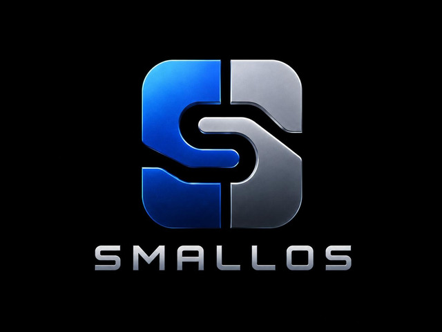

# SmallOS



SmallOS is a BIOS-booted 32-bit x86 hobby operating system. It builds a raw
hard-disk image, boots through a two-stage loader, enters protected mode,
enables paging, mounts an ext2 filesystem, and runs a small shell plus ring-3
user programs.

The project is intentionally small enough to understand end to end, but it now
has real subsystems: process scheduling, user/kernel syscalls, persistent disk
state, framebuffer graphics, TCP services, a hosted TinyCC build, and a
BusyBox-backed Unix compatibility layer inside the guest.

## Highlights

- BIOS boot from a raw disk image:
  stage 1 loads stage 2 with CHS, stage 2 uses LBA reads for the kernel.
- 32-bit protected-mode C kernel with its own GDT, IDT, TSS, paging setup, and
  page-fault handling.
- E820-aware physical memory manager plus a simple kernel heap for permanent
  kernel allocations.
- Preemptive round-robin scheduler with kernel tasks, ring-3 ELF processes,
  per-process address spaces, per-process kernel stacks, `fork`, `execve`,
  legacy spawn-style `exec`, `waitpid`, `yield`, zombie reaping, and
  user-fault isolation.
- `int 0x80` syscall ABI for console I/O, files, directories, cwd, process
  control, pipes, descriptor duplication, heap growth, time, framebuffer
  display, input, sockets, polling, and timer/signalfd-style shims.
- ATA and USB mass-storage block devices with an ext2-backed VFS. ATA is
  writable; USB BOT/SCSI storage is mounted read-only today. The generated
  filesystem includes `/bin`, `/usr/bin`, `/usr/sbin`, `/usr/libexec/tests`,
  `/etc`, `/boot`, `/var`, and `/tmp`, with boot diagnostics persisted at
  `/var/log/boot.txt` when the mounted filesystem is writable.
- Framebuffer terminal with VGA text fallback, boot timing prefixes captured in
  `/var/log/boot.txt`, graphical boot splash that covers final startup work,
  PS/2 keyboard, retrying OHCI USB boot keyboard/mouse probing, PS/2 plus
  VMware mouse input, and several graphics demos.
- PCI networking with e1000 and RTL8139 NIC support, DHCP, ARP, IPv4,
  UDP/NTP clock sync, UDP DNS resolver traffic, runtime `ip`/`ipconfig`
  inspection and configuration,
  Linux-shaped `eth0`/`lo` interface/route ioctls for BusyBox `ifconfig` and
  `route`, minimal rtnetlink for BusyBox `ip link`/`ip addr`/`ip route`/
  `ip neigh`, `/proc/net/arp` for BusyBox `arp`, resolver/service helpers for
  BusyBox `hostname`/`ipcalc`/`netstat`/`nslookup`/`pscan`, raw ICMP sockets
  for BusyBox `ping`, BusyBox `nc`/plain HTTP `wget`/`whois`/`ftpget`/
  `ftpput`/`tftp`/`tcpsvd`/`udpsvd`/`tftpd`/`httpd`, BusyBox `udhcpc`
  routed through the native DHCP operation, a compact TCP service task,
  passive sockets, `poll`/`epoll` readiness, FTP, TFTP, echo, WHOIS, and
  HTTP server smoke paths, plus boot-started TinySSH root public-key login.
- Guest userland includes familiar commands such as `ls`, `tree`, `cat`,
  `more`, `man`, `pwd`, `touch`, `mkdir`, `rm`, `cp`, `mv`, `edit`, `date`, `ip`,
  `ipconfig`, `login`, `passwd`, `uptime`, `halt`, and `reboot`, plus diagnostics such as
  `cpuz`, `usbinfo`, `usbports`, `usbpower`, `mousetest`, and demos/ports such
  as `mandel`, `plasma`, `fractint`, and `wolf3d`.
- Normal boot now hands the console to native `/bin/login`. The sample image
  stages `root:x` in `/etc/passwd` with an empty `/etc/shadow` password so
  development boots remain passwordless until `passwd` sets a SmallOS hash.
- BusyBox is staged as `usr/bin/busybox` from unmodified upstream source; the
  SmallOS libc/sysroot now carries the small POSIX/GNU compatibility surface it
  needs. Native `/bin` tools remain first in shell command lookup, while BusyBox
  fills gaps such as `grep`, `sed`, `awk`, `df`, `du`, `free`, `ps`, `tar`,
  `gzip`, `gunzip`, checksum tools, and `hexdump`, network applets such as
  `ifconfig`, `route`, `arp`, `ip`, `hostname`, `ipcalc`, `netstat`,
  `nslookup`, `pscan`, `ping`, `nc`, plain HTTP `wget`, `whois`, `ftpget`,
  `ftpput`, `tftp`, `tcpsvd`, `udpsvd`, `tftpd`, `httpd`, `udhcpc`, `udhcpd`,
  and `dumpleases`, login-flow applets such as `init`, `login`, and `getty`,
  plus link/node utilities such as `ln`, `link`, `readlink`, `mkfifo`, and
  `mknod`. `/bin/sh` launches BusyBox `ash` with basic POSIX job-control support
  for script-style compatibility without replacing `/bin/shell`.
- The root image seeds visible `/proc` and `/dev` mountpoint directories, while
  the compatibility layer supplies their virtual entries for Unix tools:
  memory, uptime, process, mount, filesystem, network, null, zero, urandom, tty,
  console, standard-fd, and PTY paths.
- TinyCC is built as `usr/bin/tcc` from unmodified upstream sources and can
  compile and `-run` sample C programs inside SmallOS through the installed
  `/usr/include` and `/usr/lib` sysroot.
- GNU binutils is built as hosted SmallOS userland and staged in `/usr/bin`,
  including `as`, `ld`, `ar`, `ranlib`, `nm`, `objdump`, `readelf`, `objcopy`,
  `strip`, `strings`, `size`, and `addr2line`. The guest test suite includes a
  static `binutilsprobe` round trip that assembles, archives, indexes, links,
  inspects, copies, strips, and executes generated i386 ELFs inside SmallOS.

## Requirements

Build tools:

```text
nasm
i686-elf-gcc
i686-elf-ld
i686-elf-objcopy
gcc
gcc-multilib
python3
qemu-system-i386
svn
curl
patch
bzip2
unzip
```

Most third-party package sources are git submodules, including Wolfenstein 3-D;
Fractint is exported by `make deps` from the official SVN tag:

```bash
git clone --recurse-submodules <repo-url>
cd SmallOS
```

If the repository was cloned without submodules, run:

```bash
make deps
```

That initializes git submodules and exports Fractint from
`https://svn.fractint.net/tags/fractint-20-04p17`.

## Build And Run

Build the canonical artifacts:

```bash
make clean && make
```

This writes `build/img/smallos.img` and `build/img/smallos.vmdk`. QEMU boots
the raw image directly. For hardware USB testing, `make usb-image` refreshes
the stable burn target at `build/img/smallos-wyse-s10-direct-usb.img`.
Build-profile directories include the display backend, serial mode, and NIC
selection, for example `build/bin/auto-serial-e1000/`. The seeded ext2 image is
built under `build/bin/<profile>/ext2.seed.img`, then
copied to the mutable runtime partition at `.state/ext2.img`. Guest-created
files survive normal rebuilds, while the `.state/ext2.img.stamp` dependency
lets Make refresh the runtime partition when userland binaries or seeded manual
pages change. Reset it from the current seed image with:

```bash
make reset-disk
```

Write the USB image to a whole device, not a partition:

```bash
sudo dd if=build/img/smallos-wyse-s10-direct-usb.img of=/dev/sdX bs=4M conv=fsync status=progress
```

To rebuild only the raw image:

```bash
make image
```

To rebuild only the VMware/ESXi wrapper from the same raw image:

```bash
make vmdk
```

Interactive runs:

```bash
make run       # QEMU curses display, default
make run-gtk   # graphical GTK display
make run-sdl   # graphical SDL display
```

`make run` uses QEMU user-network NAT with an e1000 NIC by default, and the guest acquires
its IPv4 configuration with DHCP. `make run-usb-storage` boots the same raw
image through QEMU OHCI USB mass storage, which exercises the protected-mode
USB storage path instead of the IDE disk path. `make run-usb-storage` keeps
the loader2 RAM fallback disabled so protected-mode USB storage failures are
visible; use `make run-usb-storage-fallback` for the hardware-safety fallback
path. If terminal input feels
sluggish through curses, use `make run-gtk` or `make run QEMU_DISPLAY=gtk`.
Mouse-driven graphics demos and ports need a graphical QEMU backend and a
grabbed QEMU window. With GTK, click the guest and press `Ctrl+Alt+G` to toggle
mouse/keyboard grab; this is the most reliable Windows QEMU path for Wolf3D.
For Wolf3D sound, expose QEMU's AC97 device for digitized PCM and AdLib for
FM SFX/music, for example
`-audiodev sdl,id=audio0,in.voices=0,out.frequency=48000,out.buffer-length=50000` plus
`-device AC97,audiodev=audio0` and `-device adlib,audiodev=audio0`. SB16 is
still supported as a fallback, but QEMU's GTK frontend can freeze display
updates while SB16 ISA DMA playback is active.

Headless run with serial logging:

```bash
make run-headless
tail -f /tmp/smallos-serial.log
```

Headless QEMU writes its PID and monitor socket to:

```text
/tmp/smallos.pid
/tmp/smallos-monitor.sock
```

Use `QEMU_MEMORY_MB=128` to exercise more of the PMM-managed memory range.

## Networking

The default run and test paths use QEMU user-network NAT. Host forwarding can
be passed through `QEMU_NET_HOSTFWD`; for example, this forwards host port
2323 to the guest echo service port:

```bash
make run-headless \
  QEMU_NET_HOSTFWD=',hostfwd=tcp::2323-:2323'
```

Inside the guest, FTP, web, and SSH services start by default:

```text
usr/sbin/ftpd --quiet
usr/sbin/cserve --port 8080 --root /var/www --max-conn 28 --log off
usr/sbin/tinyssh-start
```

TinySSH service stdout and stderr are logged inside the guest at
`/var/log/tinyssh.log`.

Forward guest port `22` to connect with OpenSSH from the host:

```bash
make run-headless QEMU_NET_HOSTFWD=',hostfwd=tcp::2222-:22'
ssh -tt -o IdentitiesOnly=yes -p 2222 -i .state/tinyssh-smoke-ed25519 root@127.0.0.1
```

Additional or replacement services can still be launched from the shell:

```text
bg usr/sbin/tcpecho
bg usr/sbin/ftpd --log-file /var/log/ftpd.log
bg usr/sbin/cserve --config /etc/cserve.ini
```

Shell job control supports `jobs`, `fg <jobid>`, Ctrl+Z, and `kill <jobid>`.
BusyBox `ash` also uses the kernel stopped-job path for foreground/background
process groups.
Manual `ftpd` launches write service output to `/var/log/ftpd.log`; manual
`cserve` launches use the log path from `/etc/cserve.ini`.

For TAP networking, create and configure the TAP interface on the host first,
then run:

```bash
make run-tap QEMU_NET_IFACE=tap0
make run-headless-tap QEMU_NET_IFACE=tap0
```

One simple Linux TAP setup is:

```bash
sudo ip tuntap add dev tap0 mode tap user "$USER"
sudo ip link set tap0 up
sudo ip addr add 192.168.100.1/24 dev tap0
```

Bridge or route that interface if the guest should reach beyond the host.

Inside SmallOS, `ip` and `ipconfig` show and update the runtime IPv4
configuration:

```text
ip
ip addr add 192.168.100.2/24 gateway 192.168.100.1 dns 1.1.1.1
ip route add default via 192.168.100.1
ip dns set 1.1.1.1
ip dhcp
ipconfig /all
```

BusyBox `ifconfig`, `route`, `arp`, `ip link`, `ip addr`, `ip route`,
`ip neigh`, `hostname`, `ipcalc`, `netstat -r`, `nslookup`, `pscan`, `whois`,
IPv4 `ping`, `nc`, plain HTTP `wget`, `ftpget`, `ftpput`, `tftp`, `tcpsvd`,
`udpsvd`, `tftpd`, `httpd`, and `udhcpc` use the same `eth0`, loopback, route,
DNS, ARP-neighbor, raw ICMP, UDP, IPv4/TCP, and native DHCP paths through
Linux-shaped network ioctls, minimal rtnetlink, `/proc/net`, socket syscalls,
`SYS_NET_OP_DHCP`, and libc resolver/service helpers. Libc resolver calls
support numeric IPv4, `localhost`, optional `/etc/hosts`, and DNS A-record
lookups via the configured DNS server. BusyBox `udhcpd` and `dumpleases` are
built for compatibility, but the DHCP server applet is not run by the smoke
suite and full raw-packet server behavior is still outside the guaranteed
surface.

VMware ESXi deploys use the same VMDK and the same DHCP/NIC path:

```bash
make esxi-smoke ESXI_SMOKE_FLAGS="--host 10.10.0.13"
```

That target builds, uploads, replaces the VM disk, reboots, waits for
`SmallOS ready`, and checks the VMware boot markers. See `docs/build.md` for
the baseline VM shape and lower-level deploy/log helpers.

## Verification

Fast regression path:

```bash
make test
```

`make test` boots headlessly, checks the boot diagnostics, runs the shell
selftest, drives the interactive `readline` prompt, and verifies shipped
programs against expectations under `tests/shell/` and `tests/elfs/`. The suite
covers the quick shell-visible binutils smoke test plus the deeper
`usr/libexec/tests/binutilsprobe` generated-ELF round trip.

Useful verification targets:

```bash
make verify          # layout checks, guest regression suite, reboot/halt smoke
make verify-display  # framebuffer/VGA screenshots plus GUI launch smoke
make verify-network  # socket EOF/parallel, FTP, FTP loop, cserve, BusyBox net, TinySSH
make verify-full     # all verification targets
```

Focused smoke targets are also available:

```bash
make smoke
make smoke-reboot
make smoke-halt
make display-smoke
make gui-smoke
make usb-storage-smoke
make usb-ramdisk-fallback-smoke
make socket-eof-smoke
make socket-parallel-smoke
make ftp-smoke
make ftp-loop-smoke
make cserve-smoke
make busybox-net-smoke
make tinyssh-smoke
```

## Repository Layout

```text
.
├── assets/          boot splash source/rendered assets
├── docs/            subsystem notes and deeper design docs
├── patches/         third-party patches applied in build-local copies
├── samples/         files seeded into the guest filesystem
├── src/
│   ├── boot/        BIOS stage 1, stage 2, kernel entry, ELF embedding helper
│   ├── drivers/     display, input, block, ATA/USB storage, ext2, PCI, net
│   ├── exec/        ELF loader
│   ├── kernel/      memory, paging, process, scheduler, syscall, VFS, time
│   ├── shell/       shell, parser, line editor, built-in commands
│   └── user/        user commands, demos, tests, runtime headers and libc-ish code
├── tests/           guest shell and ELF expectation files
├── third_party/     TinyCC, FTP packages, cserver, Wolf3D, and Fractint source
├── tools/           image builders, layout checks, QEMU test harnesses
├── Makefile
└── linker.ld
```

Generated artifacts live under `build/`. Persistent guest disk state lives
under `.state/`.

## Documentation

The README is meant to be the front door. For a practical, non-technical
walkthrough, start with the [SmallOS User Guide](USER_GUIDE.md).

The detailed subsystem notes live in `docs/`:

- [Build system](docs/build.md)
- [Boot process](docs/boot.md)
- [Architecture](docs/architecture.md)
- [Execution and scheduling](docs/execution.md)
- [Memory](docs/memory.md)
- [Filesystem](docs/filesystem.md)
- [Syscalls](docs/syscalls.md)
- [User runtime](docs/user-runtime.md)
- [Socket subsystem](docs/socket-subsystem.md)
- [Interrupts](docs/interrupts.md)
- [Development notes](docs/development.md)

## Disk Image Shape

The final image is assembled as:

```text
LBA 0       boot sector / MBR
LBA 1-16    stage-2 loader
LBA 17+     sector-padded kernel
after that  mutable ext2 partition
```

The boot sector stores MBR-style entries for the kernel region and the ext2
partition. Stage 2 reads the kernel location from the image metadata; the
kernel mounts ext2 through the first storage path that validates: writable ATA,
read-only USB mass storage, then the loader2-published RAM fallback. The default
`BOOT_RAMDISK_FALLBACK=never` policy skips the fallback preload for normal
VM/IDE boots. `BOOT_RAMDISK_FALLBACK=auto` preloads only when EDD does not
identify the boot drive as USB or ATA; `make usb-image` and the dedicated
USB fallback run/smoke targets force it on so hardware boots remain
recoverable when protected-mode USB storage is not happy yet. USB EDD boots
probe and byte-check direct high-memory
reads before using them; otherwise the loader falls back to its low-memory
bounce buffer. Boot diagnostics are captured with `[ms=... tick=... cyc=...]`
prefixes in `/var/log/boot.txt`; display output is muted once the protected-mode
kernel owns the terminal, then the bitmap splash is shown as soon as the shell
has been preloaded and remains visible until the welcome block and shell prompt
replace it. DHCP, NTP, and default services continue asynchronously during that
covered window, and their quiet-path messages are still appended to the boot
log. `make boot-layout-check`, `make image-layout-check`, and
`make usb-storage-smoke` keep those contracts honest before hardware runs.
